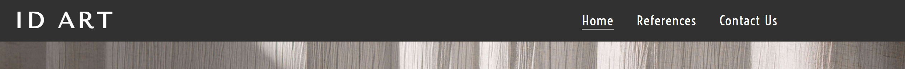
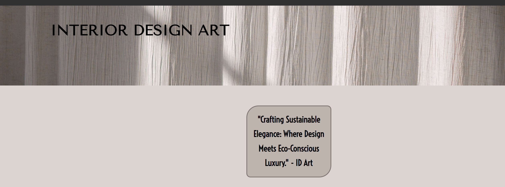
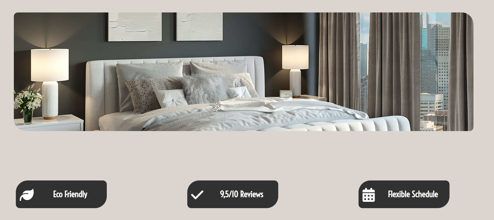
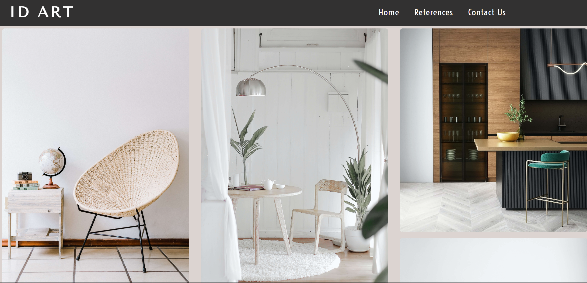
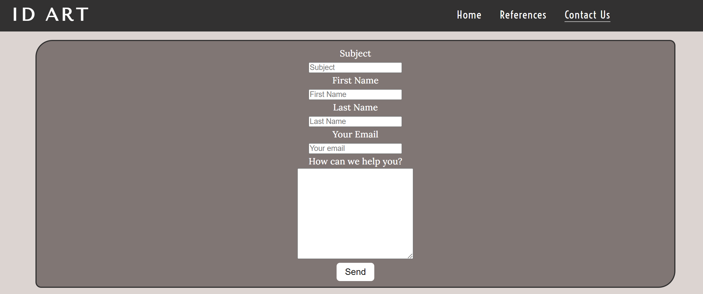
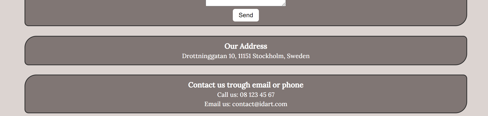
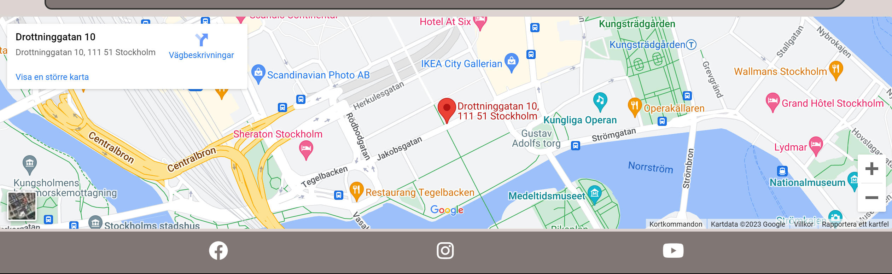
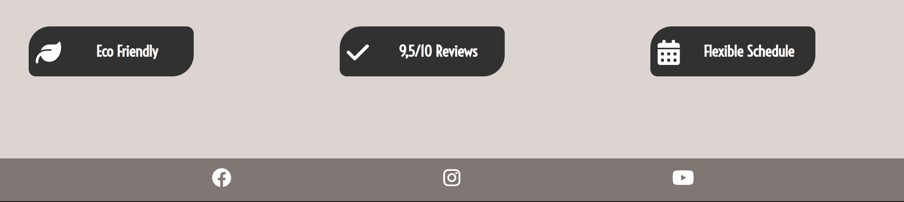

# Interior Design Art

  

Welcome to Interior Design Art - ID Art.

This website is intended to showcase a interior stylists brand, gallery (references) and the contact section reach the stylists.
The website contains of three html-pages - homepage, contact-page and a gallery-page. This is achieved by using semantic html elements such as heading, main and footer and nav. Other relevant elements are also added to display the relevant content.

The user can interact with the webpage by displaying pictures and scrolling thorugh the contents on every html page - there is a responsive navbar that has a dropdown menu at smaller screens and on tablets and higher resolutions it becomes a horisontal navbar in the header. There is also a iframe with google maps and a contact form to fill out if the user want's to get in contact.

[Link to the GitHub repository](https://github.com/markohautala/portfolio-project-1)

[Link to the deployed/live project](https://markohautala.github.io/portfolio-project-1/)

### Existing Features and the sites purpose
Homepage - consists of a header with a logo inside, and a navbar so that the user can go to other html pages such as "reference projects" and a "contact form".
All of these pages have the same consistent styling regarding the header and navbar. There is also a styling so that the user knows which page the user is currently on - this is made by having a border-bottom of 1px solid on the current HTML-page - this helps the user to know what page the user is currently on. Also, to help the user to get back to the "home-page" the user kan click on the "ID-ART" logo which redirects the user back to that HTML-page.

  

In the homepage there is also a slogan for the brand and a hero-image. 

  

Under the hero-image there is a styling-picture and underneath there are three sections that showcase three different benefits for the company/brand.

  

References - another html-page - this page is simple but effective and it has a masonry style layout to showcase reference-projects that the brand or company has performed before. The purpose if this is to showcase what they can acomplish regarding styling. This page is responsive so that the columns increase as the page width expands.

  

Contact us - the third and last html-page - this page has a form-section as it's first element. In the form the user can submit their subject, first and last name together with their email and the main message. It all ends with a submit-button.

  

Beneath the form, there are two sections - one shows the adress to the company, and the second section shows email and phonenumber details. 

  

After those two sections there is a iframe google maps section, to show where the company is visually in a google-map.

  

All the pages have the same design concerning header, footer, logo and nav-bar - to give a consistent and good UX to the user.
The footer consists of three social media logos. 

  

### Design and UX

Design Considerations for Colors and Fonts:

When creating the webpage, we wanted to ensure that the colors and fonts used harmoniously complemented the images on the home page. To achieve this, we employed a helpful tool available at [this webpage](https://html-color-codes.info/colors-from-image/). This tool allowed us to extract color codes for the body, header, buttons, and navigation bar by first uploading the hero image to the website and then selecting the colors directly from the image itself.

This approach of extracting colors from the image was a deliberate design choice, as it guaranteed a cohesive and visually pleasing appearance. This careful selection of colors not only enhanced the user experience (UX) but also contributed to an aesthetically pleasing design that aligns with the imagery.

Font Selection:

In terms of choosing the right font for the webpage, we opted for "Voltaire" as the primary font. In the event that a user's device does not support the Voltaire font, we set up a backup font system utilizing Helvetica and other sans-serif fonts. We settled on Voltaire as the primary font because it presented an attractive visual aesthetic and ensured that the text on the webpage was easily readable, promoting a user-friendly experience. This font choice was made with both design and legibility in mind to create an appealing and accessible web page.

### Coding languages that are used

Accoring to GitHub, these are the coding-languages that are used in the project:
- HTML: 53.9%
- CSS: 27.2%
- Dockerfile: 10.1%
- Python: 4.7%
- Shell: 4.1%

### Browser Compatibility and Testing

We've made sure that the website works smoothly on different web browsers, without any problems. This way, all visitors can enjoy a consistent and easy experience, no matter which browser they use.

Validation by W3C:

To make our project better, we had experts check our code. They confirmed that our code follows the rules and standards used in the industry, which makes our website stable and well-structured.

Testing on Different Browsers:

We tested our project on many popular browsers, like Chrome, Firefox, Safari, and Edge, to make sure it works well on all of them.

Responsive Design and Readability:

We also focused on making the design of our website flexible. This means that it can adjust to different screen sizes, making sure everything on the page looks good and is easy to read, no matter what device you're using. This was made by using different media-queries on different screen-widths and adjusting the elements according to them so that there is a good visual experience.

In short, we've worked hard to ensure that our website is compatible with different browsers, follows industry standards, and looks good and is easy to use on any device.

### Deployment procedure
This site is deployed using GitHub pages. To deploy the page using GitHub pages:

- Login or signup to GitHub.
- Go to the repository for this project: link.
- Click the settings button.
- Select pages in the left hand navigation menu.
- From the source dropdown, select main branch and click save.
- The site has now been deployed - it might take a few minutes for it to load.

### Problems/bugs that we have encountered along the way and how they were solved
- The images would not show up altough we did write the css rule correctly - what we did notice was that the images folder was not inside of the assets folder. This was easily fixed.
- The iframe is stuck under the footer - they should both be fully visible and be aligned next to each other. This was solved by removing the property of height: 100vh; in the main-section.
- The h1 heading moved itself when we added divs into index.html, and this was fixed by making it have the value of relative instead of absolute to the position-property.

### What tools have been used
- [Font Awesome](https://fontawesome.com/) for the icons 
- [TinyPNG](https://tinypng.com/) to make all the imagefiles smaller 
- All the images in the website are copyright-free from [this link](<https://unsplash.com/s/photos/interior>)
- the color-schemes for this project are actually taken from the banner image itself. We used [html color from image](https://html-color-codes.info/colors-from-image/)-website and picked the different color codes from there, by uploading the header-image and picking colors from it.
- Google fonts are used to display the fonts in the logo and the rest of the webpages textareas.
- DevTools has been used all the time during the development process to preview the code-changes. Mobile-first design has been the first focus and then we have moved on to adjust the content to higher media queries to make the pages and content responsive.

  
### Things to add in the futute to the webpage
- Copyright information to the footer
- More html-pages to the navbar - one that explains the different reference-projects more in detail and maybe a costumer review section from Trustpilot or something of that kind to reassure the visitor/user that the service is trustworty, genuine and apprecieted by others.
- A logo in form of a icon or a picture - the same picture could then be placed as the favicon aswell. This would be better for the overall branding.
- The styling of the contact-section to the responsive sizes.

### Lighthouse report

- Performance: 73%

- Accessibility: 97%

- Best Practices: 100%

- SEO: 100%

