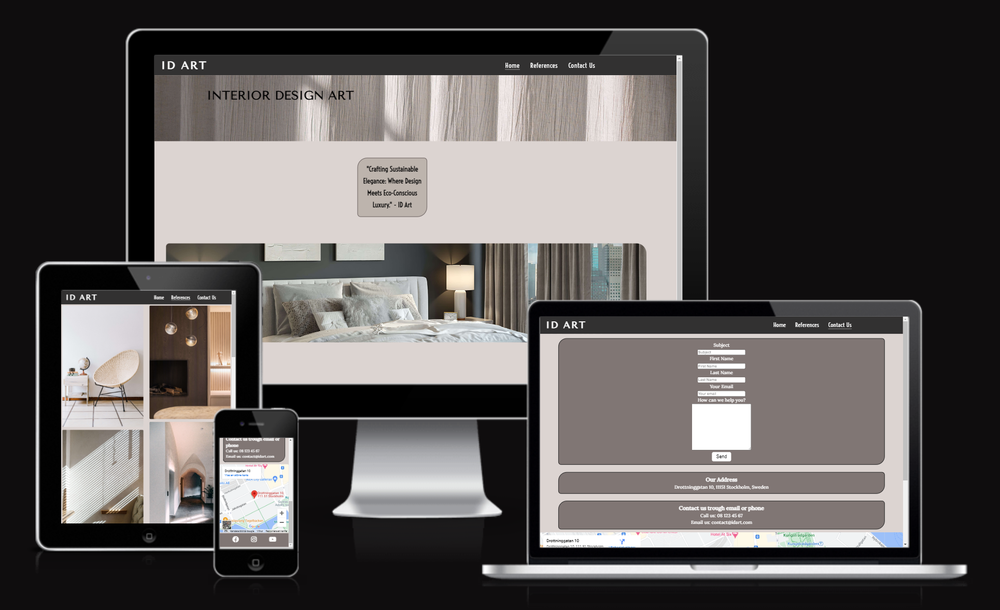

# Interior Design Art

  

Welcome to Interior Design Art - ID Art.

This website is intended to showcase a interior stylists brand, gallery (references) and the contact section reach the stylists.
The website contains of three html-pages - homepage, contact-page and a gallery-page. This is achieved by using semantic html elements such as heading, main and footer and nav. Other relevant elements are also added to display the relevant content.

The user can interact with the webpage by displaying pictures and scrolling thorugh the contents on every html page - there is a responsive navbar that has a dropdown menu at smaller screens and on tablets and higher resolutions it becomes a horisontal navbar in the header. There is also a iframe with google maps and a contact form to fill out if the user want's to get in contact.

[Link to the GitHub repository](https://github.com/markohautala/portfolio-project-1)

[Link to the deployed/live project](https://markohautala.github.io/portfolio-project-1/)

### Coding languages that I have used

Accoring to my GitHub, these are the coding-languages that are used in the project:
- HTML: 53.9%
- CSS: 27.2%
- Dockerfile: 10.1%
- Python: 4.7%
- Shell: 4.1%

### Browsers and testing

The website has been tested and seamlessly operates across various browsers, free from any compatibility issues. It ensures a smooth and consistent user experience for all visitors.

### Deployment procedure
This site is deployed using GitHub pages. To deploy the page using GitHub pages:

- Login or signup to GitHub.
- Go to the repository for this project: link.
- Click the settings button.
- Select pages in the left hand navigation menu.
- From the source dropdown, select main branch and click save.
- The site has now been deployed - it might take a few minutes for it to load.

### Problems/bugs that I have encountered along the way and how they were solved
- The images would not show up altough I did write the css rule correctly - what I did notice was that the images folder was not inside of the assets folder. This was easily fixed.
- The iframe is stuck under the footer - they should both be fully visible and be aligned next to each other. This was solved by removing the property of height: 100vh; in the main-section.
- The h1 heading moved itself when I added divs into index.html, and this was fixed by making it have the value of relative instead of absolute to the position-property.

### What tools I have used
- [Font Awesome](https://fontawesome.com/) for the icons 
- [TinyPNG](https://tinypng.com/) to make all the imagefiles smaller 
- All the images in the website are copyright-free from [this link](<https://unsplash.com/s/photos/interior>)
- the color-schemes for this project are actually taken from the banner image itself. I used "html color from image"-website and picked the different color codes from there.
- Google fonts are used to display the fonts in the logo and the rest of the webpages textareas.
- DevTools has been used all the time during the development process to preview the code-changes. Mobile-first design has been the first focus and then I have moved on to adjust the content to higher media queries to make the pages and content responsive.

  
### Things to add in the futute to the webpage
- Copyright information to the footer
- More html-pages to the navbar - one that explains the different reference-projects more in detail and maybe a costumer review section from Trustpilot or something of that kind to reassure the visitor/user that the service is trustworty, genuine and apprecieted by others.
- A logo in form of a icon or a picture - the same picture could then be placed as the favicon aswell. This would be better for the overall branding.
- The styling of the contact-section to the responsive sizes.

### Testing
- The projects sourcecodes has been validated by W3C for both the html-codes and CSS and were all verified and validated.
- The project has been tested and works in different browsers.
- Using the DevTools, the design is responsive and everything is readable and in good sizes so that the user can see all the different elements with ease.

### Lighthouse report

- Performance: 73%

- Accessibility: 97%

- Best Practices: 100%

- SEO: 100%

### Existing Features

- Homepage - consists of a header with a logo inside and a navbar so that the user can go to other html pages such as reference projects and contact form and information
In the homepage there is also a slogan for the brand and a picture. Under the picture three are three sections that showcase three benefits for the company/brand.

- References - this paga is simple but effective and it has a masonry style layout to showcase reference-projects that the brand or company has performed before. The purpose if this is to showcase what they can acomplish. 

- Contact us - this page has a form-section as it's first element. In the form the user can submit their subject, first and last name together with the email and the main message. It all ends with a submit-button.
Beneath the form, there are two sections - one shows the adress to the company, and the second section shows email and phonenumber details. After those two sections there is a iframe google maps section, to show where the company is visually.

- All the pages hade the same design concerning header, footer, logo and nav-bar - to give a consistent and good UX to the user.
The footer consists of three social media logos.
